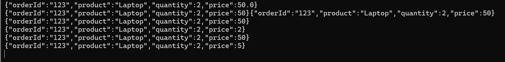
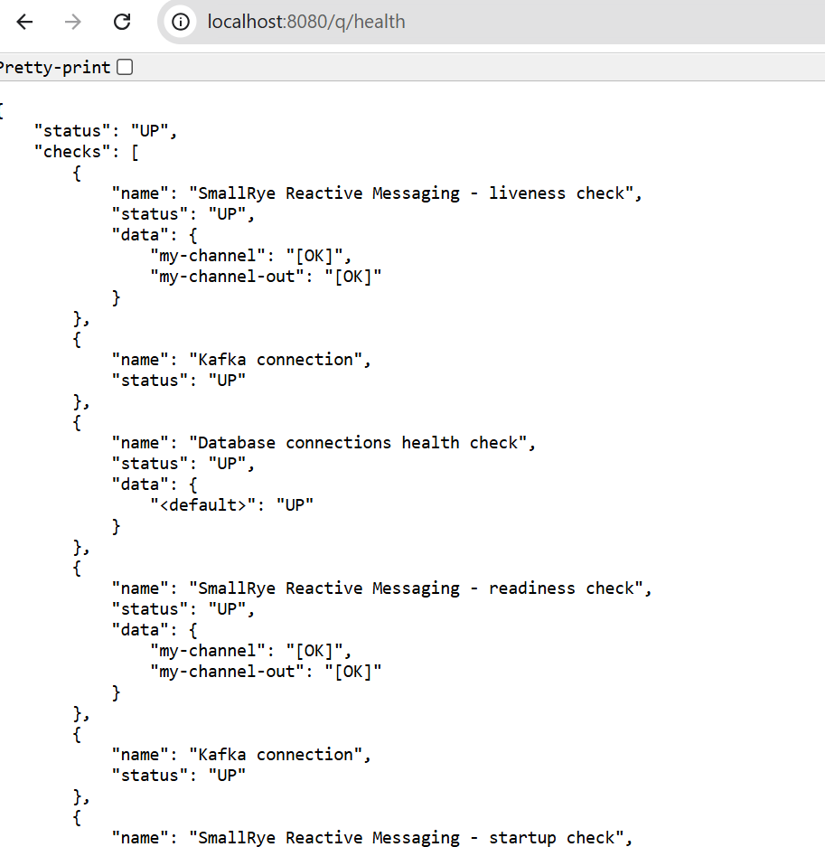
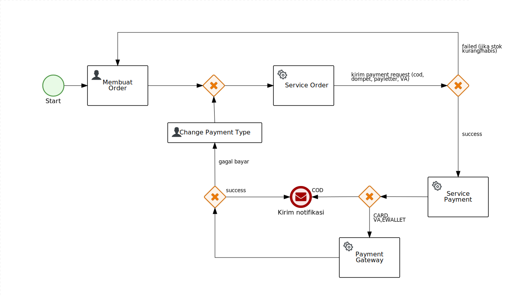
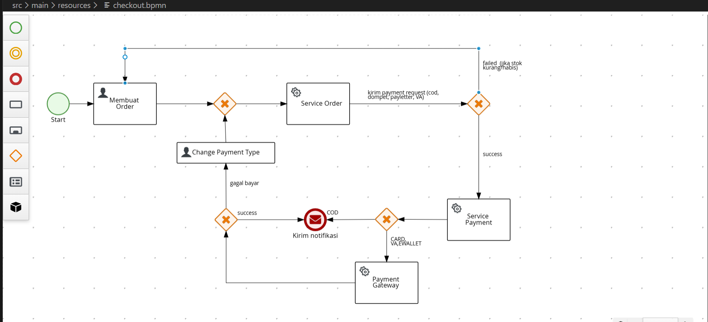

# Cara Build dan Penjelasan

# question :
Soal 1
Bangun layanan yang menerima data dari Kafka topic, melakukan manipulasi data, dan menulisnya kembali ke Kafka atau menyimpannya ke database.

Menggunakan tech stack:
Programming Language: Java 17;

```shell script
D:\IFG\listenkafka>java -version
java version "17.0.12" 2024-07-16 LTS
Java(TM) SE Runtime Environment (build 17.0.12+8-LTS-286)
Java HotSpot(TM) 64-Bit Server VM (build 17.0.12+8-LTS-286, mixed mode, sharing)
```
Framework: Quarkus;

{QUARKUS VERSI : 3.29.4}
<quarkus.platform.version>3.29.4</quarkus.platform.version>

Dataset: Bebas;

=============> contoh request:
contoh nya ada di class test > kafka/producer/KafkaProducerOrderTest.java
 

Database: Bebas;

{MYSQL}

jdbc:mysql://localhost:3306/mydb?allowPublicKeyRetrieval=true&useSSL=false


# PERSIAPAN
# INSTALL DB di DOCKER 
```shell script
    docker run --name mysql-container -e MYSQL_ROOT_PASSWORD=P@ssw0rd123 -p 3306:3306 -d mysql:latest
```
buat databse dengan nama "mydb"
anda bisa membuka (uncommand) di aplication properties

>>>>>>> quarkus.hibernate-orm.database.generation=drop-and-create

# INSTALL KAFKA di DOCKER

untuk kafka anda bisa menjalankan docker-composer.yml yang ada di project
- masuk path > docker-compose.yml

```shell script
cd docker-composer.yml
```


```shell script
        docker-compose up -d
```
>>>> buat 2 topik  di cmd 

"orders-input"    (data untuk order)
```shell script
 docker exec -it kafka  kafka-topics --create --topic orders-input --bootstrap-server localhost:9092 --partitions 1 --replication-factor 1
```
"orders-output"   (data untuk payment)
```shell script
  docker exec -it kafka  kafka-topics --create --topic orders-output --bootstrap-server localhost:9092 --partitions 1 --replication-factor 1
```


>>>>> create produce orders-input

```shell script
docker exec -it kafka kafka-console-producer --topic orders-input --bootstrap-server localhost:9092
```
jalankan project di nya
```shell script
mvn quarkus:dev
```

"Di sini bisa memasukan dataset atau message yang bakal di kirim ke project ini"

 atau saya sudah buatkan di > src/test/java/kafka/producer/KafkaProducerOrderTest.java


"untuk keterangan lain nya bisa di liat command di project java saya, terimakasih"


# HASIL 
yang masuk ke kafka topik "ordrs-output" hanya yang memenuhi kriteria



# Pengecekah helth 

anda bisa cek dengan url : http://localhost:8080/q/health
cek untuk apakah kafka sudah connect atau belum



=====================soal no 2 =========================


# Soal 2
Buatkan BPMN untuk proses checkout di marketplace, termasuk penjelasan mengenai service yang digunakan serta ilustrasi BPMN-nya dalam test code tersebut. Buatkan prosesnya menggunakan Kogito.

karena soal no 1 dan no 2 berhubungan tentang order dab checkout maka saya satukan:

# note
untuk prosses order saya simpan ke dalam kafka topik "order-input"
sedangkan untuk data payment saya simpan ke dalam database

# Hasil BPMN
src/main/resources/checkout.bpmn
svg

image



=========struktur data project saya ==========
```shell script
D:.
├───.idea
├───.mvn
│   └───wrapper
├───src
│   ├───main
│   │   ├───docker
│   │   ├───java
│   │   │   ├───health
│   │   │   ├───kafka
│   │   │   │   ├───consumer
│   │   │   │   └───producer
│   │   │   ├───model
│   │   │   │   └───entity
│   │   │   └───service
│   │   └───resources
│   │       └───META-INF
│   │           └───processSVG
│   └───test
│       └───java
│           └───kafka
│               └───producer
└───target
├───classes
│   ├───health
│   ├───kafka
│   │   ├───consumer
│   │   └───producer
│   ├───META-INF
│   │   └───processSVG
│   ├───model
│   │   └───entity
│   └───service
├───generated-sources
│   └───annotations
├───generated-test-sources
│   └───test-annotations
├───maven-archiver
├───maven-status
│   └───maven-compiler-plugin
│       ├───compile
│       │   └───default-compile
│       └───testCompile
│           └───default-testCompile
├───quarkus
│   └───bootstrap
├───quarkus-app
│   ├───app
│   ├───lib
│   │   ├───boot
│   │   └───main
│   └───quarkus
├───surefire-reports
└───test-classes
└───kafka
└───producer


```


=======================================================================================
# README DEFAULT

# listenkafka

This project uses Quarkus, the Supersonic Subatomic Java Framework.

If you want to learn more about Quarkus, please visit its website: <https://quarkus.io/>.

## Running the application in dev mode

You can run your application in dev mode that enables live coding using:

```shell script
./mvnw quarkus:dev
```

> **_NOTE:_**  Quarkus now ships with a Dev UI, which is available in dev mode only at <http://localhost:8080/q/dev/>.

## Packaging and running the application

The application can be packaged using:

```shell script
./mvnw package
```

It produces the `quarkus-run.jar` file in the `target/quarkus-app/` directory.
Be aware that it’s not an _über-jar_ as the dependencies are copied into the `target/quarkus-app/lib/` directory.

The application is now runnable using `java -jar target/quarkus-app/quarkus-run.jar`.

If you want to build an _über-jar_, execute the following command:

```shell script
./mvnw package -Dquarkus.package.jar.type=uber-jar
```

The application, packaged as an _über-jar_, is now runnable using `java -jar target/*-runner.jar`.

## Creating a native executable

You can create a native executable using:

```shell script
./mvnw package -Dnative
```

Or, if you don't have GraalVM installed, you can run the native executable build in a container using:

```shell script
./mvnw package -Dnative -Dquarkus.native.container-build=true
```

You can then execute your native executable with: `./target/listenkafka-1.0-SNAPSHOT-runner`

If you want to learn more about building native executables, please consult <https://quarkus.io/guides/maven-tooling>.
